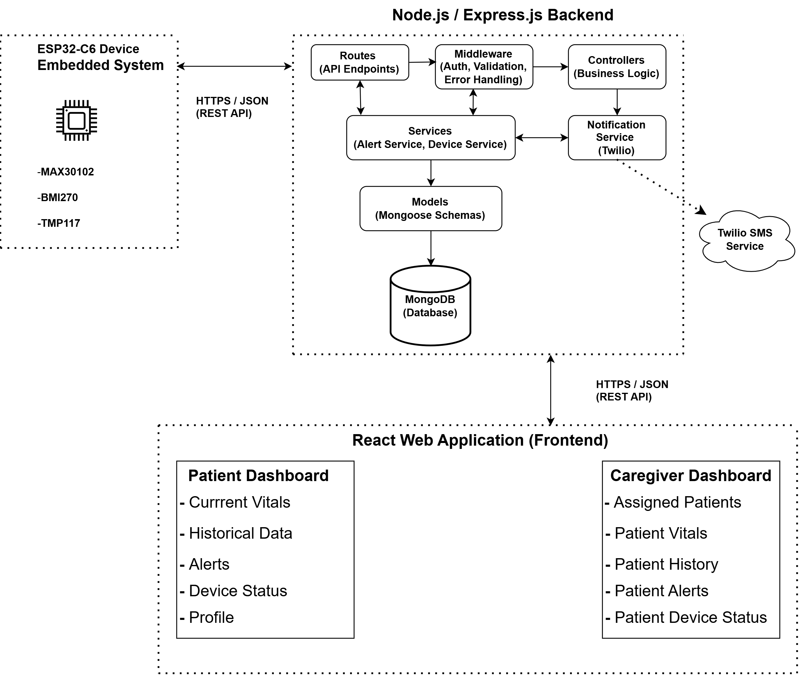

# Smart Patient Monitoring System for the Elderly

A wearable IoT patient-monitoring system designed to continuously collect vital signs,
detect potential emergency events, and provide caregivers with remote access to patient
health information through a web-based dashboard.

Developed as a Senior Design project by Group 10 in the University of Central Florida
Department of Electrical and Computer Engineering.

---

## Overview

The Smart Patient Monitoring System is a wearable device intended to support the safety
and independence of elderly individuals through continuous remote health monitoring.

The system combines embedded hardware, physiological sensors, wireless communication,
a cloud-connected backend, and a web-based caregiver dashboard. The wearable collects
patient health and motion data and transmits it wirelessly to a backend server, where the
data can be securely stored, processed, and made available to authorized users.

The system is designed to monitor:

- Heart rate
- Blood oxygen saturation (SpO₂)
- Skin temperature
- Patient movement for fall detection
- Device connectivity and status
- Emergency SOS events

When abnormal conditions or emergency events are detected, the system is designed to
generate alerts and notify an assigned caregiver.

> **Project Status:** Active Development — Senior Design II, Fall 2026

---

## Software Architecture

The system follows a layered IoT architecture connecting the wearable device to a
remote monitoring application.



### How It Works

1. Sensors connected to the ESP32-C6 collect physiological and motion data.
2. The embedded firmware processes sensor readings and formats the data as JSON.
3. The ESP32-C6 transmits the data over Wi-Fi to the backend using HTTP REST API requests.
4. The Node.js/Express backend validates and processes incoming data.
5. Patient vitals and system events are stored in MongoDB Atlas.
6. Patients and caregivers authenticate through the backend to access protected resources.
7. The React web application retrieves patient data through the REST API and displays it through patient and caregiver dashboards.
8. Emergency events can generate alerts and SMS notifications to designated caregivers.

---

## Hardware

The wearable device is built around the ESP32-C6 microcontroller, which provides the processing, peripheral interfaces, and wireless connectivity required to collect and transmit patient data.

### Current Hardware

| Component | Function | Interface |
| --- | --- | --- |
| ESP32-C6 | Main microcontroller and Wi-Fi communication | — |
| MAX30102 | Heart rate and SpO₂ sensing | I²C |
| TMP117 | Skin temperature sensing | I²C |
| 6-axis IMU | Motion sensing and fall detection | I²C |

> **Note:** The final 6-axis IMU is currently being selected as part of a hardware design revision.

### Hardware Architecture

<!-- Replace the placeholder below with the final hardware block diagram -->

> **Hardware block diagram will be added following the current hardware design revision.**

---

## Software Stack

| Layer | Technologies |
| --- | --- |
| Embedded Firmware | C, ESP-IDF |
| Microcontroller | ESP32-C6 |
| Sensor Communication | I²C |
| Network Communication | Wi-Fi |
| Application Protocol | HTTP / REST |
| Data Format | JSON |
| Backend | Node.js, Express.js |
| Database | MongoDB Atlas, Mongoose |
| Authentication | bcrypt, JSON Web Tokens (JWT) |
| Frontend | React |
| Notifications | Twilio SMS |
| API Testing | Postman |
| Version Control | Git, GitHub |

---

## REST API

The backend provides RESTful API endpoints for communication between the wearable device, database, and web application.

### Current API

| Method | Endpoint | Description |
| --- | --- | --- |
| POST | `/api/v1/vitals` | Store patient vital-sign readings |
| POST | `/api/v1/auth/register` | Register a new patient or caregiver |
| POST | `/api/v1/auth/login` | Authenticate a user and issue a JWT |

Additional patient, caregiver, device, and event endpoints are under development.

### Example Vitals Payload

```json
{
  "deviceId": "ESP32-C6-001",
  "patientId": "PATIENT-001",
  "timestamp": "2026-07-27T03:29:33Z",
  "heartRateBpm": 117,
  "spo2Percent": 96,
  "skinTemperatureC": 33.31
}